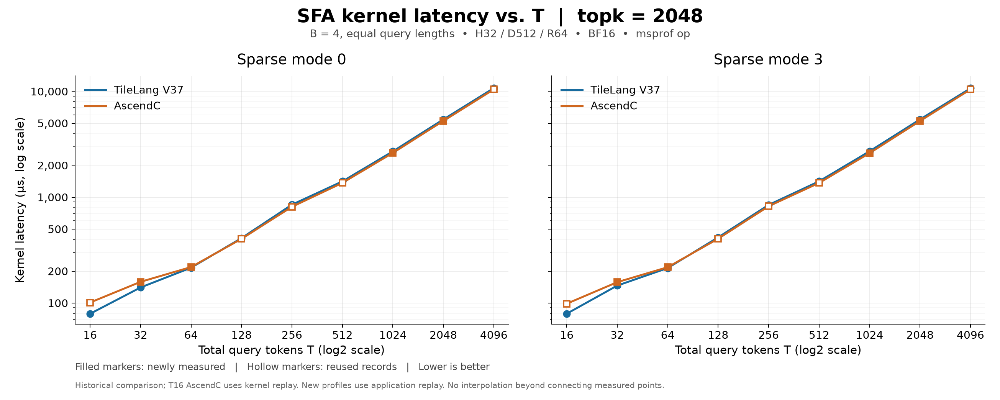

# SFA V37: manual synchronization, tile512 and paired copies

This directory contains the V37 SFA implementation with native explicit atomic
mode controls and its UB/CANN compiler driver. The branch starts at the measured TileLang commit
`d7c73142068b9a6d3df1e90a06b842da8d06962b`; it is an experimental snapshot.

## Included changes

- `T.copy(..., jump=...)` accepts a signed source pitch in elements for two GM
  rows. Expert mode on non-A5 devices supports the two-row DMA fast path;
  unsupported pitches or padded UB destinations use a single-row fallback.
  Both paths preserve ascending source-address order, including negative pitch.
- V37 uses manual synchronization, four KV workspace slots, tile512, and
  AscendC-style multibuffer UB placement. The physical UB pools total 170 KiB.
- AMLA uses integer atomic exponent updates and FP32 atomic C2 Fixpipe writes.
  A `2**-80` FP32 guard before each noninitial integer update prevents exact-zero
  cancellation from becoming NaN. The guard reuses existing UB storage.
- `compiler/sfa_ub_layout.py` contains only the operator's pool capacities,
  placement table and declarative constraints. `compiler/ub_pool_adapter.py`
  exposes `place(source, **layout_spec)` and has no operator data or version
  dispatch. It checks allocation counts, contiguous strides, dimensions,
  alignment and capacity, then rewrites the IR. The compiler driver passes
  `UB_LAYOUT` from the data module and removes the CANN-incompatible
  `syn_instr_mode` attribute. It does not infer or rewrite atomic operations.
- `T.set_atomic_add(dtype)` and `T.set_atomic_none(dtype)` lower directly to
  `hivm.hir.set_atomic`. The kernel explicitly brackets three regions: FP32
  C2 Fixpipe accumulation, the FP32 tiny guard, and int32 exponent updates.
  `PIPE_FIX` or `PIPE_MTE3` barriers complete writes before each mode change;
  chunk loops use ordinary `T.copy` within the enabled region.

The atomic-enabled AscendNPU-IR frontend is an **external build dependency**;
its source changes are not part of this TileLang repository. Merely rebuilding
TileLang with the standard CANN compiler is insufficient for this candidate.

## Supported interface

The measured specialization requires B=4 with equal query lengths S=T/4,
H=32, D=512, RoPE=64, BF16, PA_BSND KV pages of size128, block512, and topk
divisible by512. Sparse modes0 and3 are supported. T is specialized at JIT time;
the kernel schedules `min(T, number_of_AICs)` cores.

Use `sparse_mla_fwd_pa_bsnd_highperf(...)` in
`sfa_variable_t_opt_v37_zero_guard.py`. It returns `(Output, SoftmaxMax,
SoftmaxSum)` with shapes `[T,32,512]`, `[1,T,32]`, `[1,T,32]`.
`ActualQLengths` must contain cumulative lengths `[S,2*S,3*S,4*S]`.
The optional `validate_sparse_mla_metadata(...)` checks metadata values outside
the hot path. Workspace cache entries belong to one device and stream;
explicit workspaces must remain exclusive until the launch finishes.

This is not yet a drop-in fluentllm integration. Graph/KVP execution, multilayer
integration, dynamic B, unequal query lengths, and TND prefill remain outside
the validated scope. Unsupported shapes need a caller-side fallback.

## Environment

Build this branch using the normal NPUIR build instructions, with
`BISHENGIR_ROOT_PATH` pointing to matching atomic-enabled IR headers and
libraries containing `SetAtomicOp`. Setting only `SFA_ATOMIC_OPT` is insufficient:
TileLang itself must be rebuilt against that dependency. Activate the
matching PyTorch/torch_npu environment and source the CANN environment first.
The measured backend was CANN9.0.0; point `SFA_ATOMIC_OPT` at an AscendNPU-IR
`bishengir-opt` build with atomic support.

```bash
export SFA_REPO=$(git rev-parse --show-toplevel)
export SFA_CASE="$SFA_REPO/examples/deepseek_v4/sparse_mla_fwd_pa_bsnd/v37"
export SFA_CANN_COMPILER=/usr/local/Ascend/cann-9.0.0/bin/bishengir-compile
export SFA_ATOMIC_OPT=/path/to/atomic-enabled-AscendNPU-IR/build/bin/bishengir-opt
export SFA_ATOMIC_IR_DIR=$(mktemp -d /tmp/sfa-v37-ir.XXXXXX)
export TILELANG_ASCEND_MODE=Expert
export PATH="$SFA_CASE/compiler/bin:$PATH"
export PYTHONPATH="$SFA_REPO:$SFA_REPO/3rdparty/tvm/python:${PYTHONPATH:-}"
```

`SFA_PYTHON` optionally selects the interpreter used by the compiler launcher.
Use isolated TileLang caches when changing the compiler or adapter. Keep the
generated input/explicit/validated IR, atomic receipts and UB-layout JSON for
diagnostics. See [the explicit atomic API](../../../../docs/Tilelang.language/同步管道操作/T.set_atomic.md)
for supported types and caller synchronization requirements. The frontend validates explicit atomics; the matched CANN backend
performs final compilation. `SFA_CANN_COMPILER` must name the real compiler,
not this directory's launcher.

## Precision and performance

Select an idle NPU before running either command. This example uses device0.
No frozen performance baseline needs to be rerun to inspect this snapshot.

```bash
python "$SFA_CASE/regress_variable_t.py" \
  --backend npu --op "$SFA_CASE/sfa_variable_t_opt_v37_zero_guard.py" \
  --device npu:0 --tokens 512 --blocks 32 --kernel-block 0 \
  --modes 0 3 --patterns random zero wide --repeats 3 --compile-retries 2 \
  --output /tmp/sfa-v37-precision.json
```

The strict tests reuse and NaN-poison workspace, change metadata epoch0→1→0,
and verify Output/Max/Sum including empty rows. Tolerances are unchanged:
Output rtol0.02/atol0.002, Max rtol0.0002/atol0.00002,
Sum rtol0.0002/atol0.001. Only recognized compiler SIGSEGV failures are retried;
numerical and device errors fail immediately.

```bash
msprof op --output=/tmp/sfa-v37-profile \
  --aic-metrics=PipeUtilization --kernel-name=SparseMlaAmlaAtomicV37_mix_aic \
  --launch-count=20 --warm-up=5 --replay-mode=application \
  python "$SFA_CASE/profile_auto.py" --impl tilelang \
  --op "$SFA_CASE/sfa_variable_t_opt_v37_zero_guard.py" \
  --tokens 512 --topk 2048 --kernel-block 0 --expected-block 512 \
  --sparse-mode 3 --device 0 --warmup 5 --iterations 25 \
  --compile-failure-log /tmp/sfa-v37-compile.json
```

For a new AscendC comparison, install `flash_ops`, use `--impl ascendc` and
`--kernel-name=SparseFlashAttention`. `--fluentllm-root` is optional when its
Python package is not already on the import path. The helper preserves the
measured seed, tensor generation order, scale, page mapping and indices.

Check that profiling actually produced20 `OpBasicInfo` samples with the
expected kernel, frequency and launch dimensions. `msprof` may exit0 when its
child fails, so its return code alone is insufficient. Application replay can
overwrite the final compile JSON; the full log retains retry markers.

Host-only reference checks and copy-jump tests are also available:

```bash
python "$SFA_CASE/regress_variable_t.py" --backend reference --small
TILELANG_ENABLE_SIMT=0 TILELANG_ASCEND_DEVICE_NAME=Ascend910B \
  python -m pytest testing/python/language/test_tilelang_language_copy_jump.py
```

The second command requires the native NPUIR TVM/TileLang build but does not
launch a device kernel. Device copy tests are in
`testing/npuir/memory_ops/test_copy_jump_exp.py`.

## Measured results

See [performance.md](performance.md), [machine-readable samples](performance.json),
and [source provenance](provenance.json). The previous T-scaling run added18 valid
profiles (360 samples) and90 strict precision calls, all passing. Previous
AscendC and V37 measurements are reused. For T≥128 and topk2048, V37 achieves
95.5%–98.4% of AscendC performance, exceeding the80% target.



## Publication checks

The pinned pre-commit hooks pass, including clang-format, Ruff, Python AST,
credential-pattern detection, executable permissions, spelling and Markdown.
The17 host copy-jump tests and12 reference fixture cases also pass.
Those checks describe the original measured publication. The subsequent
native atomic change intentionally modifies both the kernel and TileLang code;
its validation is recorded separately below.

The UB adapter was subsequently refactored into a generic placement interface
and a separate operator allocation table.
Replay of75 captured IR records (42 distinct inputs), including single-tile
and variable block-table cases, produces byte-identical IR and identical
placement receipts to the measured adapter. Renaming the kernel symbol does
not change placement. Seven rejection checks cover missing, duplicate and
unlisted buffers, noncontiguous strides, empty input, overflow and alignment.
The layout remains170 KiB; existing performance measurements are reused.

The generic interface supports exact typed shapes and bounded wildcard
dimensions, configurable alignment, and optional allocations. Callers supply
one UB allocation domain per call and remain responsible for synchronization
between overlapping ranges. Six host-only interface tests use independent
layouts, and two driver tests verify atomic passthrough and CANN compatibility.
Run all eight from this directory without importing TileLang or accessing an NPU:

```bash
python -m unittest discover -s compiler -p 'test_*.py'
```

Clang-tidy was not run for this publication: the local checkout has no C++
compilation database, and format.sh's automatic pip --user installation fails
inside the isolated virtual environment. This does not represent a clang-tidy
pass. Historical NPU precision/performance records refer to the measured
remote source and are not new measurements of this refactor.

### Native explicit atomic validation (2026-09-11)

The isolated A2/A3 build passed all29 host API tests. Four complete lowering,
atomic frontend and CANN backend compilation cases passed on the first attempt:
T16/topk512/mode3, T512/topk2048/mode0, T512/topk2048/mode3, and
T4096/topk2048/mode3. Native input IR contains paired explicit mode changes
and no per-store `atomic = <add>` attributes.

For T512/topk2048/mode3, the combined, AIC and AIV object files are all
byte-identical to the previously validated compiler output. This establishes
binary equivalence for that specialization. The initial precision attempt was
blocked by occupied devices. Once device13 became idle,54 fresh precision calls
passed across T16/topk512, T512/topk2048 and T4096/topk2048, each with modes0/3
and random/zero/wide inputs. T512/topk2048 profiling produced40 valid samples:
mode0/3 medians1427.147/1423.697 µs, or95.61%/95.78% of historical AscendC
performance. Existing baselines were not rerun. See
[the device validation report](native_atomic_device_tests.md) and
[raw samples](native_atomic_device_tests.json). A5 code paths share the lowering
helper but were not built or device-tested in this validation.
