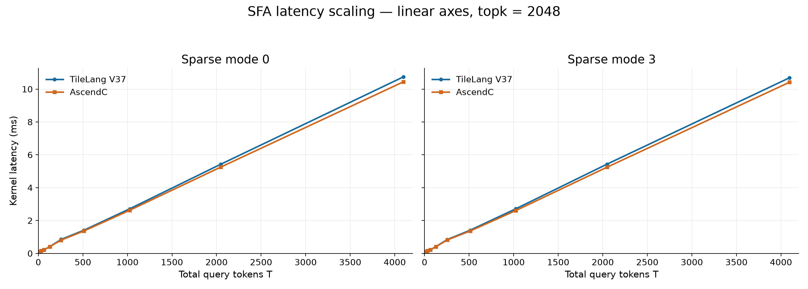

# V37 performance: topk2048, T16–4096

B=4, equal S=T/4, H32/D512/R64, BF16, PA_BSND, page128. Values are kernel Task Duration in microseconds; pairs are sparse mode0 / mode3. Relative performance = AscendC latency / TileLang latency.

| T | V37 (µs) | AscendC (µs) | Relative performance | Newly measured |
|---:|---:|---:|---:|---|
| 16 | 79.133 / 79.263 | 101.024 / 98.514 | 127.7% / 124.3% | V37 |
| 32 | 140.196 / 145.996 | 158.476 / 157.346 | 113.0% / 107.8% | Both |
| 64 | 215.369 / 213.849 | 218.509 / 217.929 | 101.5% / 101.9% | Both |
| 128 | 410.166 / 416.777 | 403.766 / 405.101 | 98.4% / 97.2% | Reused |
| 256 | 849.644 / 844.784 | 811.402 / 821.008 | 95.5% / 97.2% | Reused |
| 512 | 1410.736 / 1412.086 | 1364.495 / 1363.665 | 96.7% / 96.6% | Reused |
| 1024 | 2709.748 / 2714.129 | 2621.235 / 2607.234 | 96.7% / 96.1% | Both |
| 2048 | 5428.227 / 5433.127 | 5255.220 / 5248.140 | 96.8% / 96.6% | Both |
| 4096 | 10742.500 / 10690.278 | 10439.868 / 10419.017 | 97.2% / 97.5% | Reused |

Each new point is the median of20 msprof op samples: application replay, warm-up5, PipeUtilization,1800MHz. V37 T16 uses16 AIC/32 AIV; other V37 points and AscendC use24/48.

T16 AscendC reuses the2026-09-07 kernel-replay measurement with matching input semantics. Sampling date and replay mode differ, so this is a historical comparison, not a same-run ABA experiment. AscendC T128/256/512 retains the mean of the two historical baseline medians. Other points use one20-sample median.

All18 T/mode comparisons exceed the80% performance target. T≥128 is95.5%–98.4%. T32 and64 are slightly faster in V37; the larger T16 difference should be read with the replay caveat above.

## Precision

| T | Calls | Max absolute Output error | Max error | Sum error |
|---:|---:|---:|---:|---:|
| 16 | 18 | 0.0033418536 | 6.6757202e-06 | 0.001953125 |
| 32 | 18 | 0.0034601688 | 7.6293945e-06 | 0.0020141602 |
| 64 | 18 | 0.0036605 | 7.6293945e-06 | 0.0021972656 |
| 1024 | 18 | 0.0046053529 | 1.1444092e-05 | 0.0032958984 |
| 2048 | 18 | 0.0045616627 | 1.1444092e-05 | 0.0036621094 |

All90 calls pass the unchanged elementwise atol + rtol * abs(reference) criterion. Maximum absolute error alone does not define failure.

## Collection notes

The initial AscendC attempts were blocked by an obsolete TileLang-only argument guard and generated no samples. Only the missing profiles were collected after correcting that guard. One T64 compilation hung after a SIGSEGV retry; that task was terminated and only its missing profiles resumed. Seven compiler retry markers appear in valid profile logs. All failed attempts are excluded from performance statistics.

The published kernel and compiler transformations retain the measured computation and synchronization. Packaging adds configurable compiler paths, corrects stale comments, and removes the one-off missing-shape allowlist from the benchmark helper. No AscendC baseline was rerun for publication.
